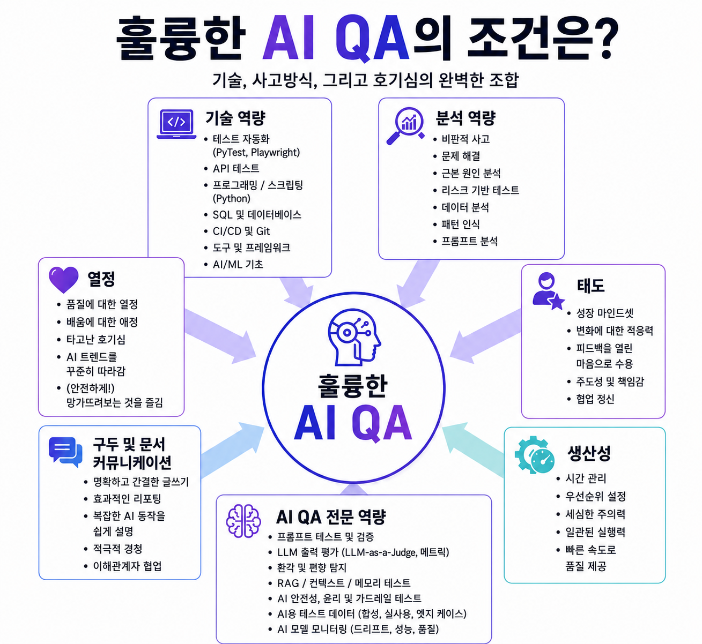

# Senior QA / Test Engineer Portfolio

> AI 도구를 활용해 QA 업무를 다시 설계하는 시니어 QA 포트폴리오입니다.  
> 핵심은 자동화 코드 자체가 아니라 **리스크 식별, 테스트 설계, 증거 수집, 릴리즈 판단**입니다.

<p align="center">
  
</p>

---

## 한 문장 소개

저는 테스트를 단순히 버그를 찾는 활동이 아니라, **요구사항과 구현 사이의 리스크를 발견하고 사용자가 받을 영향을 근거로 릴리즈 가능 여부를 판단하는 품질 의사결정 활동**으로 봅니다.

---

## 포트폴리오 안내

이 포트폴리오의 데이터, 식별자, 기준값, 시나리오, 화면, 로그는 모두 공개 데모 사이트 또는 직접 생성한 가상 데이터입니다. 현재 또는 과거 회사/고객사의 운영 데이터, 내부 문서, 비공개 명세, 실제 서비스 정보는 포함하지 않습니다.

---

## 제 테스트 관점

좋은 QA는 모든 케이스를 많이 실행하는 사람이 아니라, 제한된 시간 안에서 **가장 위험한 영역을 먼저 검증하고 남은 리스크를 설명 가능한 언어로 공유할 수 있는 사람**이라고 생각합니다.

자동화는 테스트를 대체하기 위한 목적이 아니라, 반복 회귀와 운영 부담을 줄이고 QA가 더 중요한 판단에 집중하도록 돕는 수단입니다.

최종적으로 QA의 역할은 단순 PASS/FAIL 보고가 아니라, **이번 릴리즈가 나가도 되는지 근거를 가지고 말할 수 있는 품질 판단**이라고 생각합니다.

---

## 포지셔닝

| 영역 | 요약 |
| --- | --- |
| 직무 방향 | Senior QA Engineer / Test Engineer |
| 경험 | 2015년부터 QA 엔지니어로 일해왔습니다 |
| 핵심 강점 | 요구사항 검토, 테스트 전략, 회귀 범위 선정, 결함 분석, 릴리즈 게이트 운영 |
| 테스트 관점 | 버그 탐색보다 리스크 식별, 영향 분석, 의사결정 근거 수집을 중시합니다 |
| 자동화 관점 | 자동화는 목적이 아니라 회귀 리스크와 운영 부담을 줄이기 위한 지원 도구입니다 |
| AI 활용 관점 | AI에게 QA를 맡기는 것이 아니라, AI가 만든 결과를 검증 가능한 구조 안에서 활용합니다 |

---

## 대표 프로젝트

| 프로젝트 | QA 역량 | 핵심 메시지 |
| --- | --- | --- |
| [`qa-release-gate`](https://github.com/tempesty-ai/qa-release-gate) | 릴리즈 리스크 판단 | 테스트 결과, 결함, 변경 범위, rollback 준비도를 종합해 GO / CONDITIONAL_GO / NO_GO를 판단합니다 |
| [`UI_Test`](https://github.com/tempesty-ai/UI_Test) | AI 보조 시각적 QA | AI 에이전트를 그대로 믿지 않고 Playwright 기반 하네스로 통제 가능한 시각 QA 흐름을 구성합니다 |
| [`aiops-sentinel`](https://github.com/tempesty-ai/aiops-sentinel) | AI 출력 품질 평가 | AI가 생성한 장애 분석 결과를 DeepEval 기준으로 다시 평가합니다 |
| [`ui-harness`](https://github.com/tempesty-ai/ui-harness) | UI 회귀 자동화 | 반복 회귀 리스크가 큰 핵심 플로우를 선별해 자동화합니다 |
| [`botserver`](https://github.com/tempesty-ai/botserver) | QA 협업 자동화 | 반복 질문과 인터럽트 비용을 줄이기 위한 Mattermost × OpenAI Assistant 챗봇입니다 |

---

## 포트폴리오 스토리라인

```text
ui-harness
  -> 반복 회귀를 줄이기 위해 무엇을 자동화할지 선별

UI_Test
  -> 일반 자동화로 놓치기 쉬운 시각적 회귀를 AI 에이전트와 하네스로 점검

botserver
  -> QA가 반복적으로 받는 장애/성능/배포 질문을 챗봇으로 1차 대응

aiops-sentinel
  -> AI가 만든 장애 분석 결과를 운영에 써도 되는지 품질 기준으로 평가

qa-release-gate
  -> 최종적으로 이번 릴리즈가 나가도 되는지 설명 가능한 기준으로 판단
